## 楔子

我想，对于这篇文章的出现，不仅仅是因为它被一个火车迷所著。

同时作为旅游爱好者，绿皮车有时会成为中等距离出行的首选，它能带给我的，我认为就是不紧不慢，一种在旅途中悠哉悠哉的氛围。

随着生活的快餐化，高铁、飞机等出行方式越来越普及，绿皮车，老式火车渐渐会退出人们交通出行选择的视野。而这些交通工具也一定会随着时间的推移而淘汰。

这里纪念了这种交通工具，也纪念了一种旅行的艺术。

## 上车前

在乘坐动车赶到重庆北站的途中，拍下了这张当地刚下过雨如梦如画的照片。

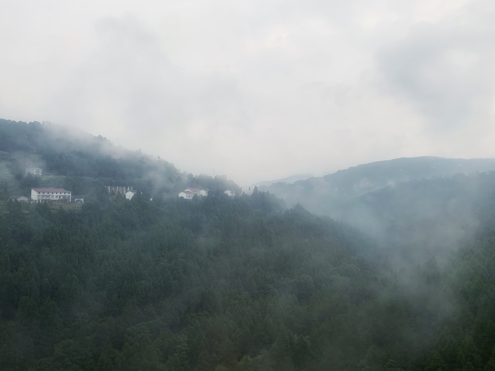

由于换乘绿皮车时，只有 10 分钟的时间换乘，所以急急忙忙没有来得及上车前拍摄火车。接下来是上车后的一些照片。

## 在车上

这里购买的是硬卧票，分为上铺、中铺和下铺。

这趟 Z 子开头的列车相较 K 子类乘坐时间较短，因为停留的车站数较少，到达杭州南站大约 17 个小时。

<video controls>
    <source src="res/img11.MOV" type="video/mp4">
</video>

<video controls>
    <source src="res/img12.MOV" type="video/mp4">
</video>

<video controls>
    <source src="res/img22.MOV" type="video/mp4">
</video>

倒数第三张图片是软卧的车厢，它们都是一个个小房间被门把走廊隔档了起来；倒数第二张图片是餐车。

#### 湖北境内

接下来为列车经过湖北境内的拍照，也是新冠疫情以来第一次进入湖北境内。

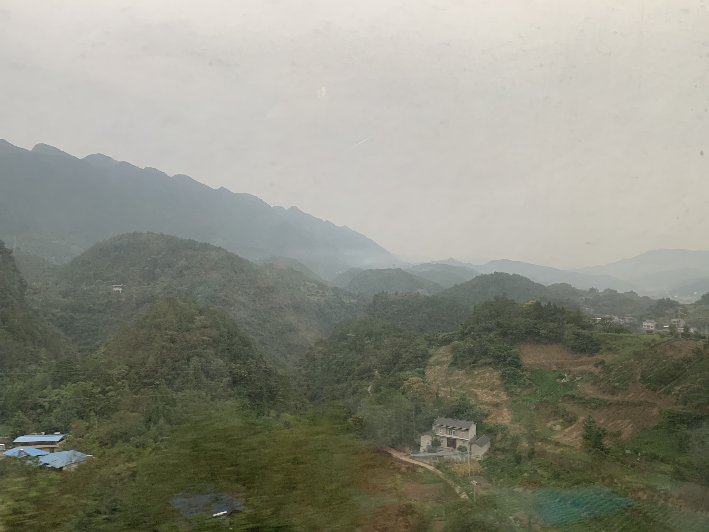

最后一张图片是宜昌城区，拍得比较糊。下面进宜昌车站。

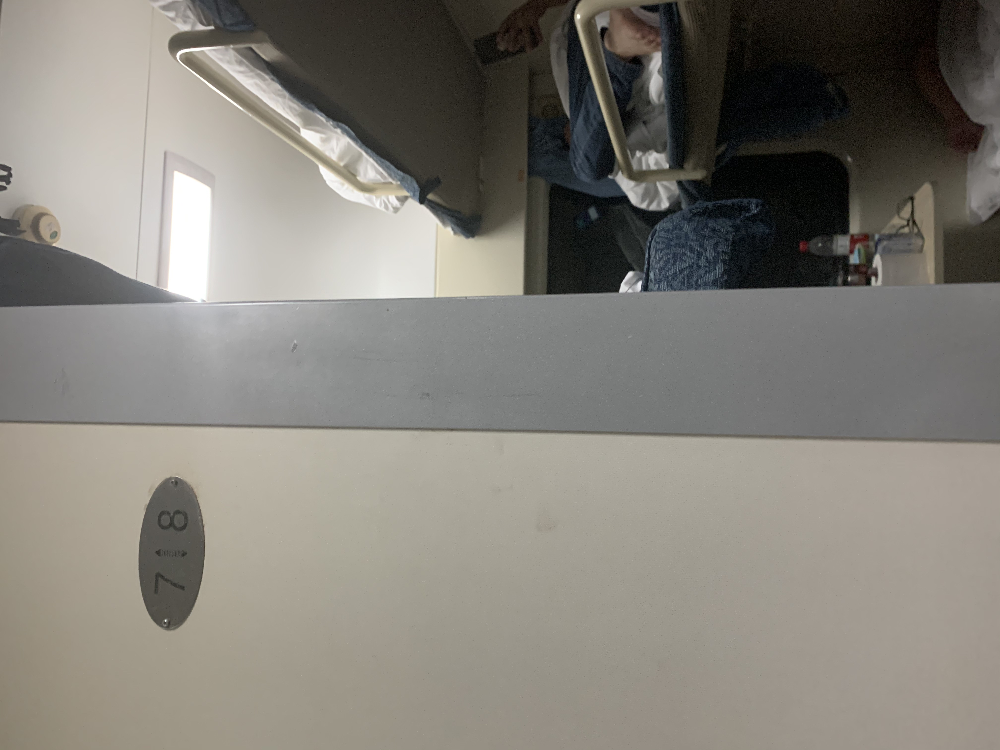

时间已达 9 点过，车厢内已经熄灯。这几张是熄灯后的车厢内照，和对车外的微弱的灯光的长曝光。（手机拍的长曝光，在车上颠簸有拿不稳的情况造成照片轻微模糊）

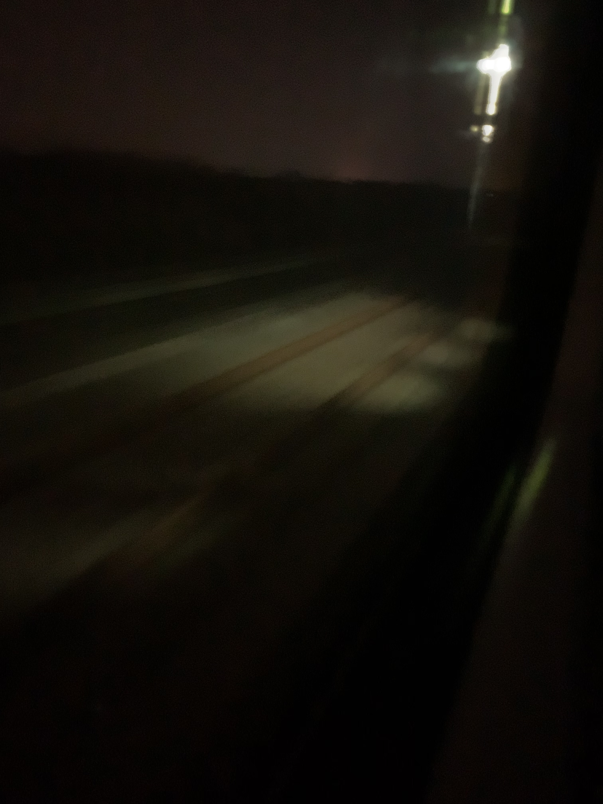

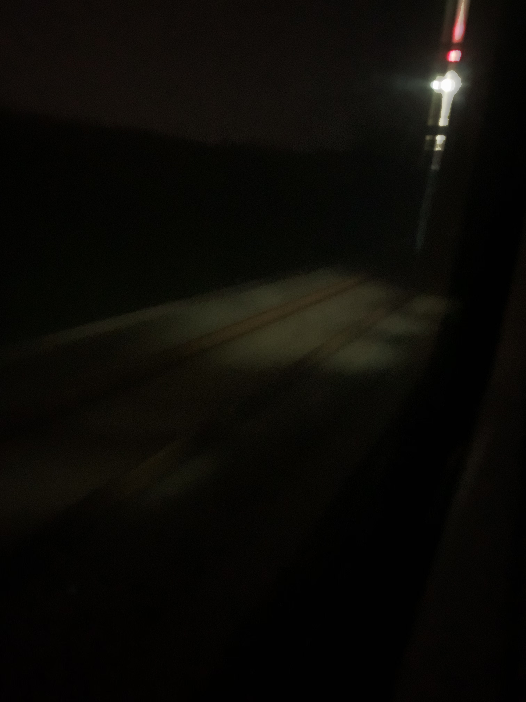

进入武汉边缘

穿过汉水

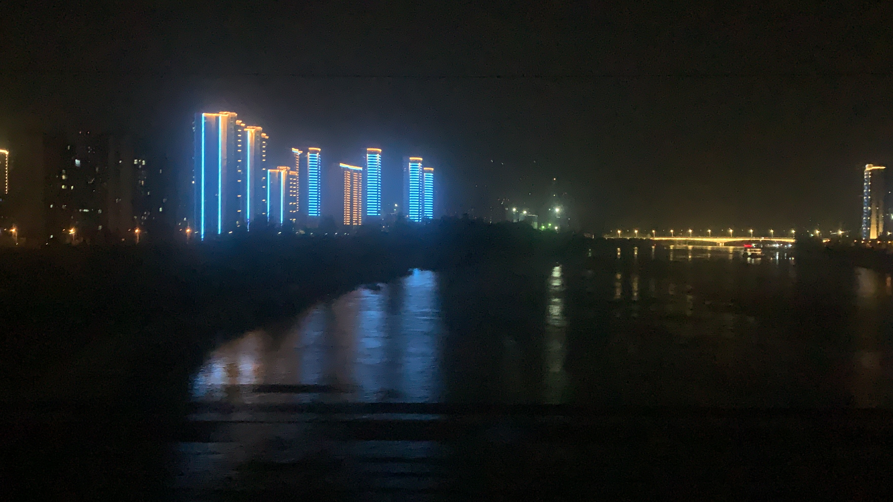

<video controls>
    <source src="res/img65.MOV" class="-cdn" type="video/mp4">
</video>

<video controls>
    <source src="res/img66.MOV" type="video/mp4">
</video>

<video controls>
    <source src="res/img67.MOV" type="video/mp4">
</video>

武汉长江大桥

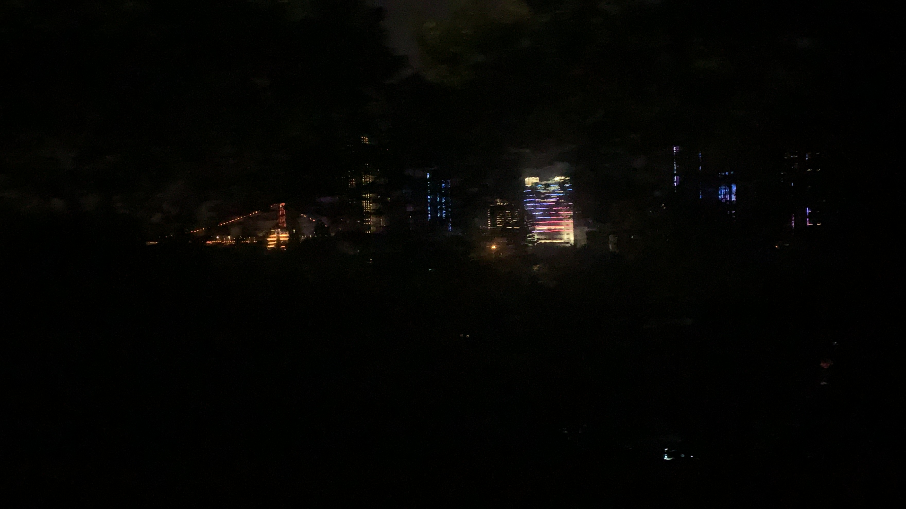

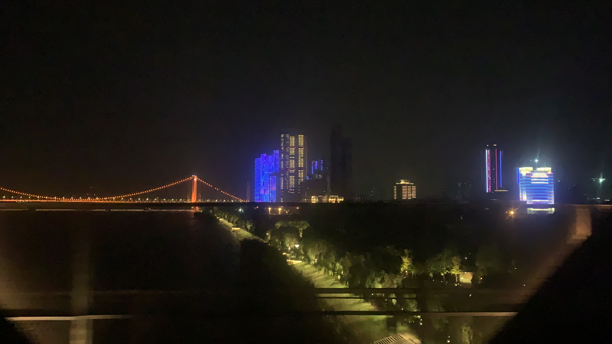
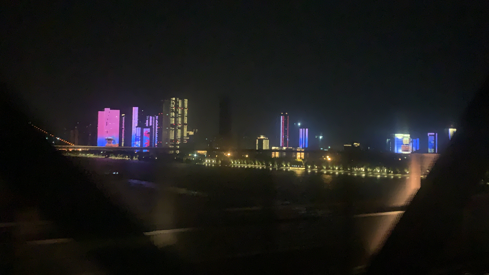

<video controls>
    <source src="res/img73.MOV" class="-cdn" type="video/mp4">
</video>

<video controls>
    <source src="res/img74.MOV" class="-cdn" type="video/mp4">
</video>

路过黄鹤楼

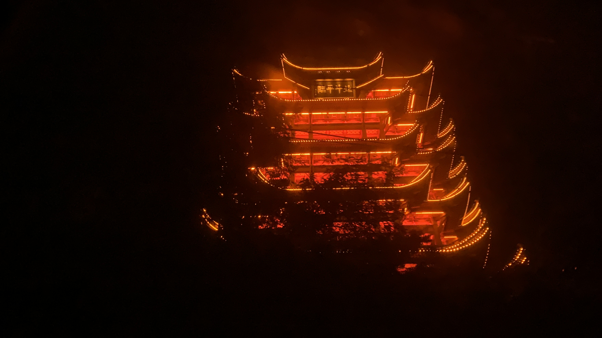

<video controls>
    <source src="res/img76.MOV" type="video/mp4">
</video>

旁边经过一辆列车，这个视频非常有大片刚开头的效果。

<video controls>
    <source src="res/img78.MOV" class="-cdn" type="video/mp4">
</video>

到达武昌站

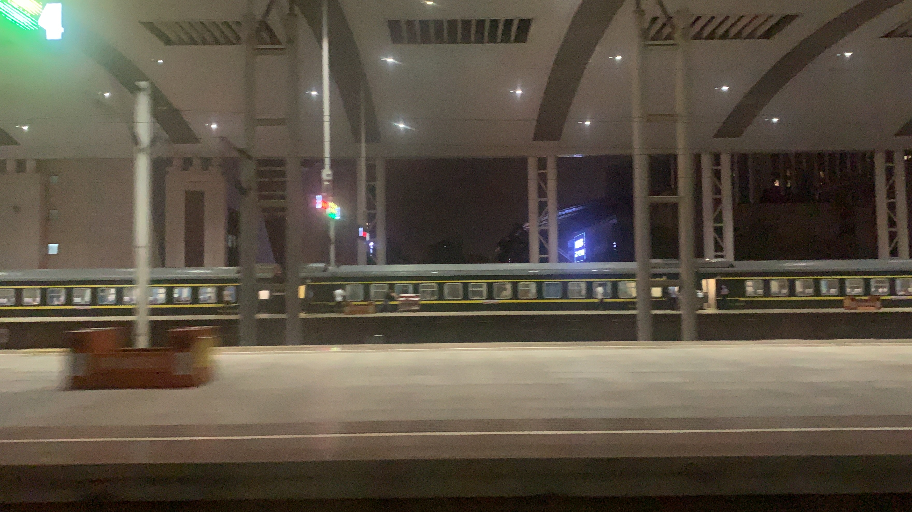
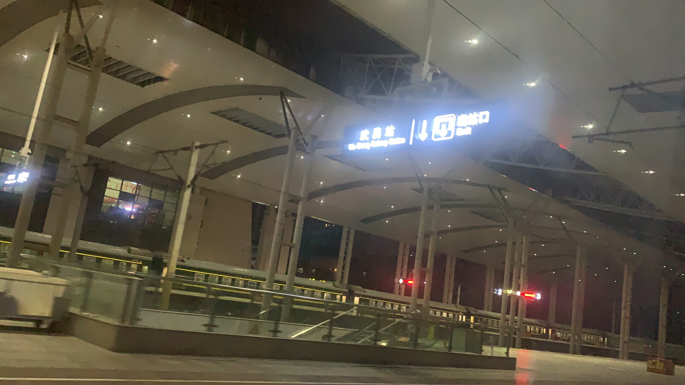

<video controls>
    <source src="res/img82.MOV" class="-cdn" type="video/mp4">
</video>

顺便下车来呼吸两口新鲜的肺炎。

等到下次出发的时候，在床上拍了两张很有意思的光轨。

#### 黎明

5 点过惊醒，发现列车已停靠在衢州站。

起床呆坐在椅子上。

<video controls>
    <source src="res/img94.MOV" class="-cdn" type="video/mp4">
</video>

静候天明

## 到站

到站了，终于有机会清楚地拍到自己列车的车身。

